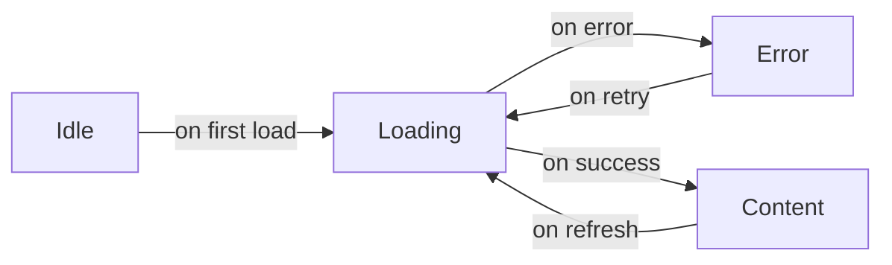
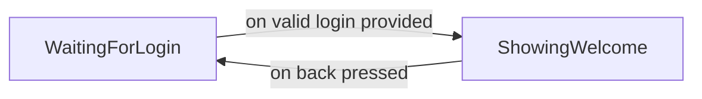

# FSM on Android: how to reach app modularity?

[TOC]

## Introduction

In this document, I want to explain how I came with a FSM as a solution to make Android application development fully-modular. That's why it's organized as steps, describing the journey I made, from discovering the [EasyFlow](https://github.com/Beh01der/EasyFlow) FSM to using it for modularity purpose.

When talking about modularity, all developers achieve a standard definition:
- divide a program into separated sub-programs (called modules) according to the features to implement,
- group similar functions in the same unit of code.

Advantages :
- ease incremental builds and deliveries,
- module is unit-testable,
- modules can be added, modified or removed without any impact on another,
- modules can be reused.

But on some implementations, I didn't agree with some choices. For example, to navigate to the next screen, a module knows the name of this next screen thanks to a constant (from the hosting application or from the next module itself): this introduces a high-coupling that smells. To my mind, to be fully independant and agnostic, a module must not depend on a constant from anywhere else. At best, it exposes constants to be used by the hosting application. So, how to transit from one screen to the next one? The answer became clear: thanks to events. Indeed, events bring the needed abstraction: the module fires an event, the hosting application receives this event and acts according to it. This is how I discovered the "event-driven development" paradigm.

According to this paradigm, the flow of the program is determined by events (user actions, network requests, sensors, timer, other threads, etc.). A specific piece of code (often called the "event listener" or "main loop" according to the language) detects that an event has occurred and performs the corresponding event "handler" (a callback method for example). The resulting computation changes the program state.

Finally, given in mind my final goal, I remembered the terms used by the Android SDK: when an `Activity` is destroyed, it talks about saving and restoring the "instance state". And all became clear for me: a "screen" can be considered as a "state" of the application, and navigation is somehow a finite state machine.

A finite state machine (FMS) is defined by:
- sequential logic circuits,
- finite number of states,
- one state at a time (the _current state_),
- change from one state to another by triggering an event (a _transition_).

For Java, the implementation I've chosen is [EasyFlow](https://github.com/Beh01der/EasyFlow), because:
- it's very simple to set up,
- it's possible to define a global context (useful to pass arguments for example),
- states are defined easily by declaring an _enum_ implementing `StateEnum`,
- events are defined easily by declaring an _enum_ implementing `EventEnum`,
- it provides a fluent API, which allows developer to declare the state machine in a clear and intelligible way (especially when combined with lambda expressions),
- it's possible to declare callbacks to perform specific jobs when entering or leaving a state.

## FSM to manage view states

Let's consider a typical example of a simple screen loading data from the network to display the result. Below we can see a state diagram corresponding to this screen.



The associated XML layout is not very relevant at this point. But just consider the following declarations in the `Activity` are valid:

```java
@BindView(R.id.ActivityMain_TextView_Content)
TextView mTextViewContent;
@BindView(R.id.ActivityMain_ProgressBar)
ProgressBar mProgressBar;
@BindView(R.id.ActivityMain_ViewGroup_Content)
LinearLayout mViewGroupContent;
@BindView(R.id.ActivityMain_ViewGroup_Error)
LinearLayout mViewGroupError;
```

Now, using the great library called [Switcher](https://github.com/jkwiecien/Switcher), we can define some fields as follows:

```java
@Override
protected void onCreate(Bundle savedInstanceState) {
    super.onCreate(savedInstanceState);
    setContentView(R.layout.activity_main);

    mUnbinder = ButterKnife.bind(this);

    mSwitcher = new Switcher.Builder(this)
            .addContentView(mViewGroupContent)
            .addErrorView(mViewGroupError)
            .addProgressView(mProgressBar)
            .build();
```

Now, to setup the FSM corresponding to the state diagram, we need to define the available `States`, `Events` and `Context` as follows:

```java
enum States implements StateEnum {
    LOADING, ERROR, CONTENT
}

enum Events implements EventEnum {
    onError, onSuccess, onRetry, onRefresh
}

class FlowContext extends StatefulContext {
}
```

And then we can set up our FSM programmatically as follows:

```java
EasyFlow<FlowContext> flow =
        from(States.LOADING).transit(
                 on(Events.onError).to(States.ERROR).transit(
                        on(Events.onRetry).to(States.LOADING)
                ),
                on(Events.onSuccess).to(States.CONTENT).transit(
                        on(Events.onRefresh).to(States.LOADING)
                )
        );
```

And now we have to define what to perform when entering in a given state (with the help of the [retrolambda library](https://github.com/evant/gradle-retrolambda)):

```java
flow.whenEnter(States.LOADING, (final StatefulContext context) -> startRequest());
flow.whenEnter(States.CONTENT, (final StatefulContext context) -> mSwitcher.showContentView());
flow.whenEnter(States.ERROR, (final StatefulContext context) -> mSwitcher.showErrorView());
```

We can start the FSM as follows:

```java
flow.executor(new UiThreadExecutor());
mFlowContext = new FlowContext();
flow.start(mFlowContext);
```

The `Executor` instance allows developper to configure the type of thread used to perfom FSM operations (such as `whenEnter`). It looks like:

```java
public class UiThreadExecutor implements Executor {
    private Handler mHandler = new Handler(Looper.getMainLooper());

    @Override
    public void execute(Runnable command) {
        mHandler.post(command);
    }
}
```

To perform the network request in this example, I use the [Volley library](https://android.googlesource.com/platform/frameworks/volley/) as follows:

```java
private void startRequest() {
    mSwitcher.showProgressViewImmediately();
    StringRequest request = new StringRequest(
            "https://api.github.com/users/RoRoche",
            (final String response) -> {
                mTextViewContent.setText(response);
                try {
                    mFlowContext.trigger(Events.onSuccess);
                } catch (LogicViolationError logicViolationError) {
                    Log.e(TAG, "startRequest", logicViolationError);
                }
            },
            (final VolleyError error) -> {
                try {
                    mFlowContext.trigger(Events.onError);
                } catch (LogicViolationError logicViolationError) {
                    Log.e(TAG, "startRequest", logicViolationError);
                }
            });
    mQueue.add(request);
}
```

All that remains for me to do, therefore, is to implement methods listening for user interaction:

```java
@OnClick(R.id.ActivityMain_Button_Refresh)
public void onClickRefresh() {
    try {
        mFlowContext.trigger(Events.onRefresh);
    } catch (LogicViolationError logicViolationError) {
        Log.e(TAG, "onClickRefresh", logicViolationError);
    }
}

@OnClick(R.id.ActivityMain_Button_Retry)
public void onClickRetry() {
    try {
        mFlowContext.trigger(Events.onRetry);
    } catch (LogicViolationError logicViolationError) {
        Log.e(TAG, "onClickRetry", logicViolationError);
    }
}
```

Putting it all together and it works like a charm! Transitions are logical, fluid and well-defined. The logical code is devoted to the FSM. The rest of the code consists in triggering the suitable event.

## FSM to manage app navigation

Following the same logic, I decided to set up 2 screens and manage navigation thanks to a FSM.

### Why [Conductor](https://github.com/bluelinelabs/Conductor)?

First of all, it's important to focus on the Conductor livrary I chose to create a "View-based application".

Here are many advantages of using this library:
- Navigation concerns
- Simple to build an instance of `Controller` and provide its dependencies (no args `Bundle` like when using `Fragment`)
- Bring forward the `ViewController` concept
- Pretty transitions
- Easy to integrate in a MVP or VIPER architecture

### "Screens" as "States"

The idea came to me that, in fact, a screen displayed to the user can be considered as a state of the application. I mean: for example, when presenting a screen to log in, it's a state "waiting for login", isn't it? And the event to change the app state is "valid login provided", isn't it?

The idea is to use Conductor to define each screens, and use the `Activity` to monitor the interactions and navigation.

To keep each screen independant, I decided to use the `StatefulContext` implementation to hold arguments as a `Bundle` instance (pretty familiar in the Android world, isn't?). This way, the implementation looks like:

```java
public class FlowContext extends StatefulContext {
    private final Bundle mArgs = new Bundle();

    public Bundle args() {
        return mArgs;
    }
}
```

Now it's time to design the state diagram of the features to implement:



Very simple in fact. So it's time to define our first screen ("waiting for login"):

```java
public class FirstController extends Controller {
    //region Constants
    private static final String ARG_KEY_LOGIN = "LOGIN";
    //endregion

    //region Fields
    private FlowContext mFlowContext;
    private TextInputEditText mEditTextLogin;
    //endregion

    //region Constructors
    public FirstController() {
        this(new FlowContext());
    }

    public FirstController(FlowContext flowContext) {
        super();
        mFlowContext = flowContext;
    }
    //endregion

    //region Controller
    @NonNull
    @Override
    protected View onCreateView(LayoutInflater inflater, ViewGroup container) {
        View view = inflater.inflate(R.layout.first_controller, container, false);
        mEditTextLogin = (TextInputEditText) view.findViewById(R.id.FirstController_EditText_Login);
        view.findViewById(R.id.FirstController_Button_Start).setOnClickListener(new View.OnClickListener() {
            @Override
            public void onClick(View pView) {
                onClickButtonStart();
            }
        });
        return view;
    }
    //endregion

    //region User interaction
    private void onClickButtonStart() {
        String login = mEditTextLogin.getText().toString();
        if (TextUtils.isEmpty(login)) {
            mEditTextLogin.setError(getApplicationContext().getString(R.string.login_error));
        } else {
            try {
                mFlowContext.args().putString(ARG_KEY_LOGIN, login);
                mFlowContext.trigger(Events.loginProvided);
            } catch (final LogicViolationError poLogicViolationError) {
            }
        }
    }
    //endregion

    //region FSM
    public enum States implements StateEnum {
        WAITING_LOGIN
    }

    public enum Events implements EventEnum {
        loginProvided
    }

    public static String getLogin(FlowContext flowContext) {
        return flowContext.args().getString(ARG_KEY_LOGIN);
    }
    //endregion
}
```

This screen defines its available states and events. It's necessary to pass the `FlowContext` to its constructor. After some logical controls, this screen puts the provided value to the `FlowContext` arguments and triggers the `loginProvided` event. It's its single responsability: display an interface to fill a login value, control it and notify of the sequence success.

The same way, let's define the second screen (for simplicity, it just displays the provided login):

```java
public class SecondController extends Controller {
    //region Args
    private final String mLogin;
    //endregion

    //region Constructors
    public SecondController() {
        this("");
    }

    public SecondController(String login) {
        super();
        mLogin = login;
    }
    //endregion

    //region Controller
    @NonNull
    @Override
    protected View onCreateView(LayoutInflater inflater, ViewGroup container) {
        View view = inflater.inflate(R.layout.second_controller, container, false);
        TextView textViewWelcome = (TextView) view.findViewById(R.id.SecondController_TextView_Welcome);
        textViewWelcome.setText(getApplicationContext().getString(R.string.welcome, mLogin));
        return view;
    }
    //endregion

    //region FSM
    public enum States implements StateEnum {
        SHOWING_WELCOME
    }
    //endregion
}
```

Much more simple than the previous one! But now you should ask yourself "wait! where are these screens built? where is the navigation logic? where is the back event?". Here is my point: in the `Activity`. No screen should know how to transit from one state to another. They just have to define the state they represent and the events that can be triggered. Moreover, for me, this second screen must not know the "back pressed" event. It is not its responsability to navigate back. So, now, it's time to have a look at the `Activity`:

### Navigation between screens

```java
public class MainActivity extends AppCompatActivity {

    //region Fields
    private Router mRouter;
    private EasyFlow<FlowContext> mFlow;
    private FlowContext mFlowContext;
    //endregion

    //region Lifecycle
    @Override
    protected void onCreate(Bundle savedInstanceState) {
        super.onCreate(savedInstanceState);
        setContentView(R.layout.activity_main);

        ViewGroup container = (ViewGroup) findViewById(R.id.ViewGroup_Container);
        mRouter = Conductor.attachRouter(this, container, savedInstanceState);

        mFlow =
                from(FirstController.States.WAITING_LOGIN).transit(
                        on(FirstController.Events.loginProvided).to(SecondController.States.SHOWING_WELCOME).transit(
                                on(Events.backPressed).to(FirstController.States.WAITING_LOGIN)
                        )
                );

        mFlow.executor(new UiThreadExecutor());

        mFlow.whenEnter(FirstController.States.WAITING_LOGIN, (FlowContext context) -> {
            if (!mRouter.hasRootController()) {
                mRouter.setRoot(RouterTransaction.with(new FirstController(context)));
            }
        });

        mFlow.whenEnter(SecondController.States.SHOWING_WELCOME, (FlowContext context) -> {
            SecondController loController = new SecondController(FirstController.getLogin(context));

            AndroidModularApplication.getInstance().getComponentSecondController().inject(loController);

            RouterTransaction transaction = RouterTransaction.with(loController)
                    .pushChangeHandler(new FadeChangeHandler())
                    .popChangeHandler(new FadeChangeHandler());

            mRouter.pushController(transaction);
        });

        mFlow.whenLeave(SecondController.States.SHOWING_WELCOME, (FlowContext context) -> {
            context.args().clear();
        });

        mFlowContext = new FlowContext();
        mFlow.start(mFlowContext);
    }

    @Override
    public void onBackPressed() {
        try {
            mFlowContext.trigger(Events.backPressed);
        } catch (LogicViolationError logicViolationError) {
        }

        if (!mRouter.handleBack()) {
            super.onBackPressed();
        }
    }
    //endregion

    //region FSM
    public enum Events implements EventEnum {
        backPressed
    }
    //endregion
}
```

All the valuable job is done in the "whenEnter" sequences. Indeed, when entering in the first state, we create and push the first screen in the Conductor-specific `Router` instance. When entering in the second state, we build the second screen, pass the arguments to it and push it to the `Router` using a fading `RouterTransaction`.

We override the `onBackPressed` and trigger the corresponding event to update the FSM current state. Then if the `Router` instance allows back at this level, this event is processed.

Finally, not so much complicated to. But we gain a clean design, with a perfect application of the "Single responsability principle". This Android application is now a valuable combination of "states" and "events".

## FSM to make app modular

### Screns as independent modules

You know what? It's the simplest step of this article: you just have to create two Android module ("first" and "second") thanks to the Android Studio wizard, drag and drop each piece of code in the corresponding module and that's it! So, not really: you have to create a "common" module to place the `FlowContext` and `UiThreadExecutor`. Both "first" and "second" module references this "common" module. Now, these modules can be referenced by the application successfully.

Too simple maybe? So let's  go a step further with the dependency injection topic.

### DI ready: example with [Dagger 2](https://google.github.io/dagger/)

Now you have an application divided into multiple screens (states) and responding to various events, you may ask how to define and provide the dependencies needed by your screens.
To present you a solution, I use the Dagger 2 library.

Suppose we want to display the current date on the second screen of our application. I'll start by defining an interface in the "second" module:

```java
public interface IDateFormatter {
    String format(Date date);
}
```

In the "app" module, I'm going to implement this one:

```java
public final class DateFormatter implements IDateFormatter {

    //region Constants
    private static final String DATE_FORMAT = "dd/MM/yyyy";
    private static final SimpleDateFormat sSimpleDateFormat = new SimpleDateFormat(DATE_FORMAT);
    //endregion

    //region IDateFormatter
    @Override
    public String format(Date date) {
        return sSimpleDateFormat.format(date);
    }
    //endregion
}
```

Now, let's create the suitable Dagger 2 `Module` as follows:

```java
@Module
public class ModuleSecondController {

    @Provides
    @Singleton
    public IDateFormatter providesApplication() {
        return new DateFormatter();
    }

}
```

And the `Component` to configure the second screen:

```java
@Singleton
@Component(modules = {ModuleSecondController.class})
public interface ComponentSecondController {

    void inject(SecondController secondController);

}
```

The next step is to subclass the Android `Application` class and build the `Module` and `Component` as follows:

```java
public class AndroidModularApplication extends Application {

    //region Static field
    private static AndroidModularApplication sInstance;
    //endregion

    //region Field
    private ComponentSecondController mComponentSecondController;
    //endregion

    //region Overridden method
    @Override
    public void onCreate() {
        super.onCreate();
        sInstance = this;
        mComponentSecondController = DaggerComponentSecondController.builder()
                .moduleSecondController(new ModuleSecondController())
                .build();
    }
    //endregion

    //region Static getter
    public static AndroidModularApplication getInstance() {
        return sInstance;
    }
    //endregion

    //region Getter
    public ComponentSecondController getComponentSecondController() {
        return mComponentSecondController;
    }
    //endregion
}
```

And now, the final step takes place in the `MainActivity`, it's time to inject dependencies in the second screen. So we're back into the "whenEnter" sequence, when building the second screen:

```java
SecondController controller = new SecondController(FirstController.getLogin(context));

AndroidModularApplication.getInstance().getComponentSecondController().inject(controller);

RouterTransaction transaction = RouterTransaction.with(controller)
                    .pushChangeHandler(new FadeChangeHandler())
                    .popChangeHandler(new FadeChangeHandler());

mRouter.pushController(transaction);
```

Eventually, we can add a preconditions into the second screen (defensive programming!) as follows:

```java
protected View onCreateView(LayoutInflater inflater, ViewGroup container) {
    Preconditions.checkNotNull(mDateFormatter, "Field mDateFormatter is null, did you miss to inject it with your dependency injection mechanism?");
```

His way, you can inject any element you want (data store, user preferences, etc.). But the targetted screen remains agnostic, indepentend and highly configurable.

## Conclusion

- An easy way to deal with the states of a screen
- A new approach to set up the navigation flow of an application
- A solution to build trully reusable modules
- High level of configuration with DI

- Perspectives: what about a library of existing modules, used by a "drag & drop" Web interface to design an entire application in a user-friendly way?

## Bibliography

- [Applications as State Machines](http://macoscope.com/blog/applications-as-state-machines/)